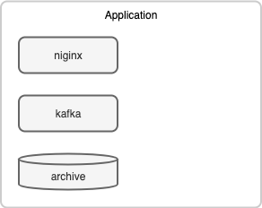
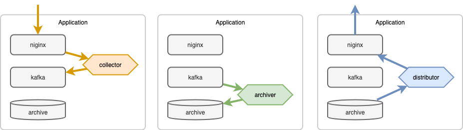
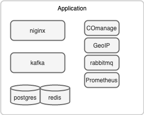

# Container Design

The docker-compose application ties together a set of containers:

A service, script, workflow, etc. runs in its own container, and works with the services provided by the other containers.

The value of this system comes when you flesh out this skeleton with all the other services that are part of your platform:

## Image data

