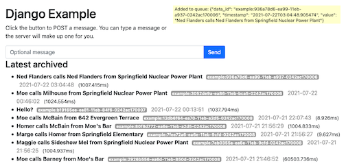
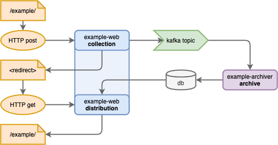
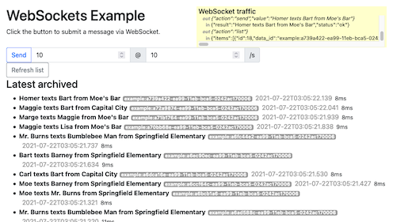
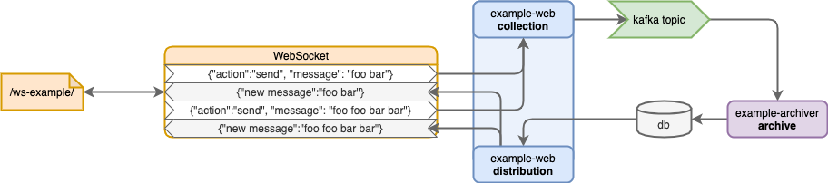

# Example

The base project includes some example functionality.

This is built from the [es-example-django](https://github.com/earthscope/es-example-django/) project.

## AVRO Schema

This uses AVRO schemas from `/avro_schemas`:

- `/avro_schemas/example-key.avsc`
- `/avro_schemas/example-value.avsc`

## Docker Containers

There are 2 basic containers run from the same base image:

- **example-web**
  - This is a Django ASGI web stack, so it can handle HTTP and WebSockets
- **example-archiver**
  - This uses the same code but runs a script that watches the Kafka topic

## Volumes

The **example-web** container should mount `/web-static` to a volume, for sharing with the nginx static web server.

## Web Example

http://localhost:8080/example/

This is a simple webpage demonstrating a message round-trip through the system.

The page is simply:
- a form for collecting a new message
- a list of the latest messages from the archive

When a message is submitted:

1. The `example-web` system puts a message on the kafka topic
2. The `example-archiver` system sees the message and adds an entry to the database
3. Meanwhile, the system sends a redirect request to the user
4. The user's browser requests a new page, which contains data queried from the database

As can be seen here, the newly submitted message **is racing** against the browser redirect. In most cases, the message beats the browser redirect -- it goes through the pipeline and is archived in the database before the browser sends its redirected request.

In essence, the page is polling the system. If the new message doesn't show up in the redirect, you can "poll" again by refreshing the page.

## WebSocket Interface

http://localhost:8080/ws-example/

This demonstrates the same roundtrip flow, but uses a WebSocket front-end which may be better suited to many use cases.

The page is similar to the web example:

But the WebSocket interface is a two-way channel, so rather than submitting a form it just sends a message across the channel.

One advantage of this system is that the client doesn't have to poll -- the system can notify it asynchronously when the message is archived (or anything else happens).

[Note: this functionality is currently not quite as described here]