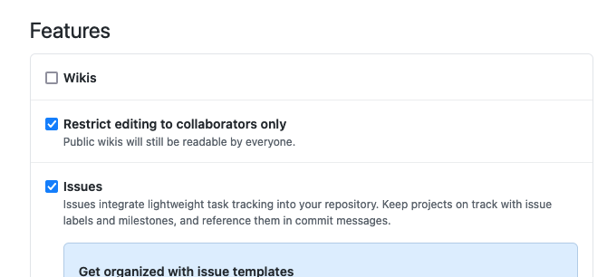
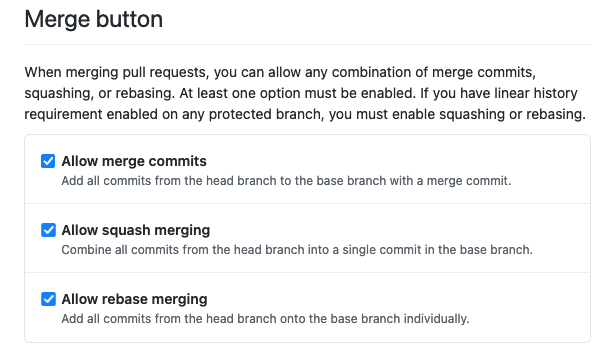
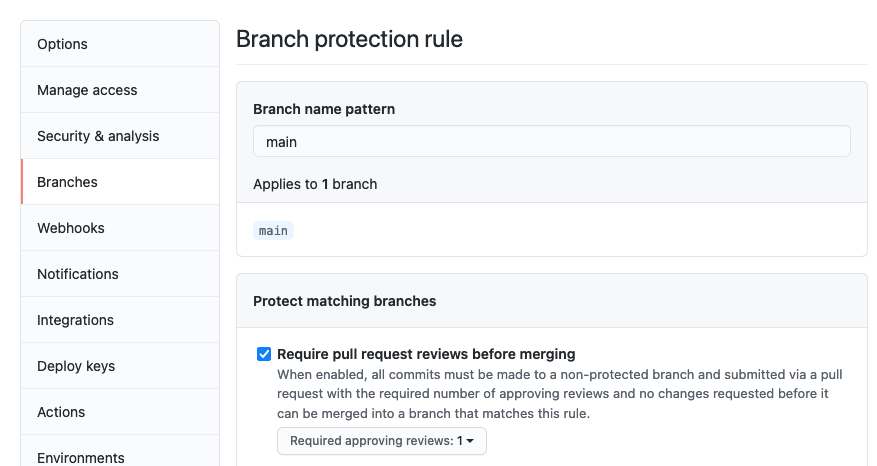
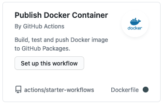

# GitHub Project

Self-documenting / discussing / debating practices for GitHub projects.

## Settings

Options available under the Settings tab.

### Features

Wikis
: No -- put documentation in the code instead

Issues
: **Always** -- see [below](#issues)

Projects
: When?

Discussions
: When?

#### Issues

##### Use issue templates

### Merge Options

Allow **all types** of merges.

### Branch Protection

For very basic protection, require pull requests for merges to main:

## GitHub Actions

### Publish Docker Container

